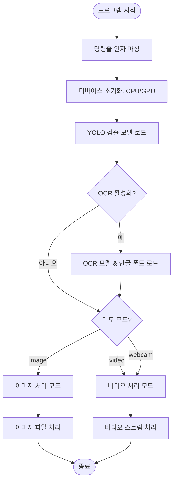
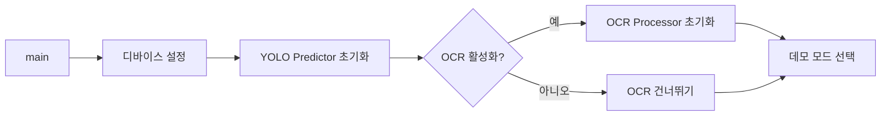
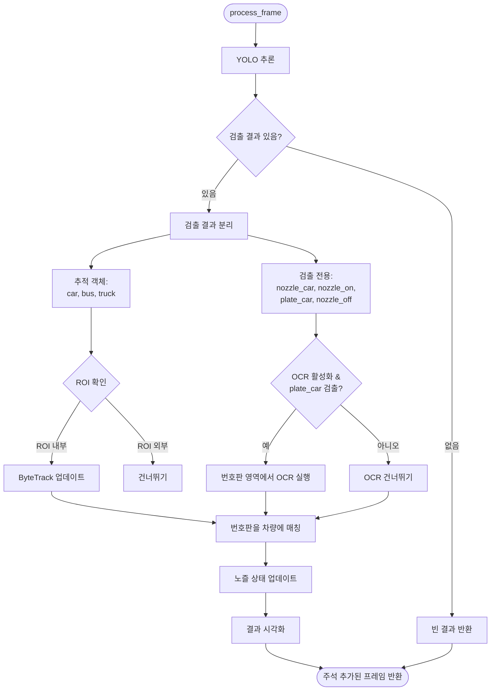
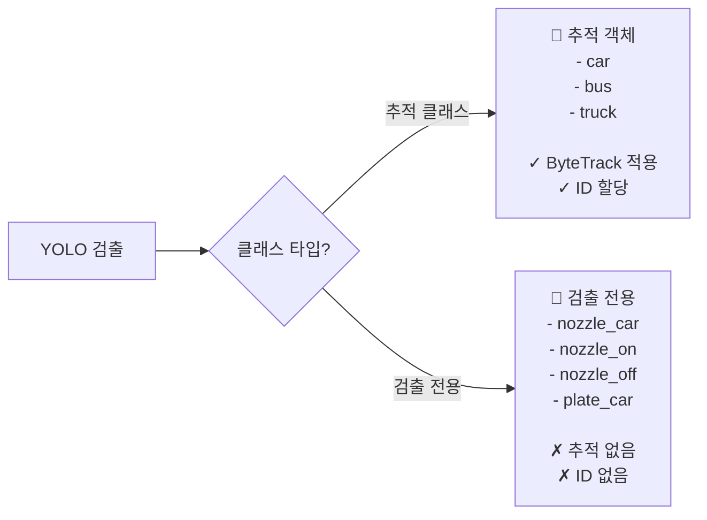
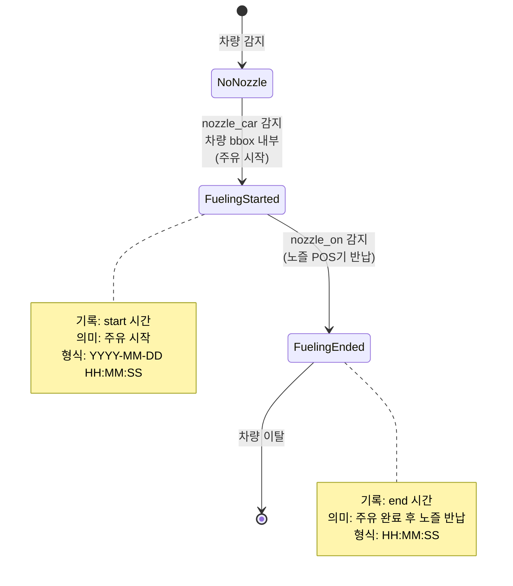
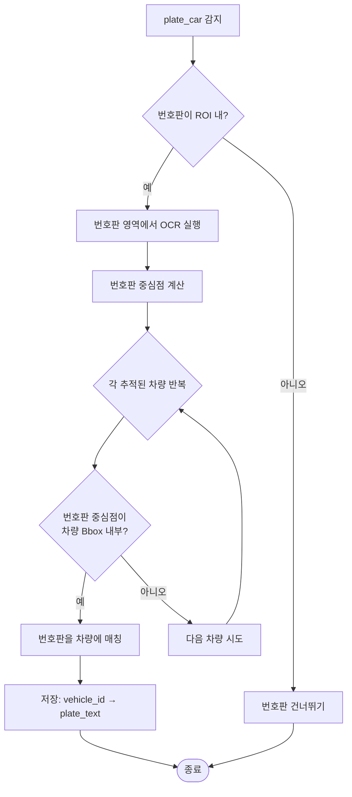
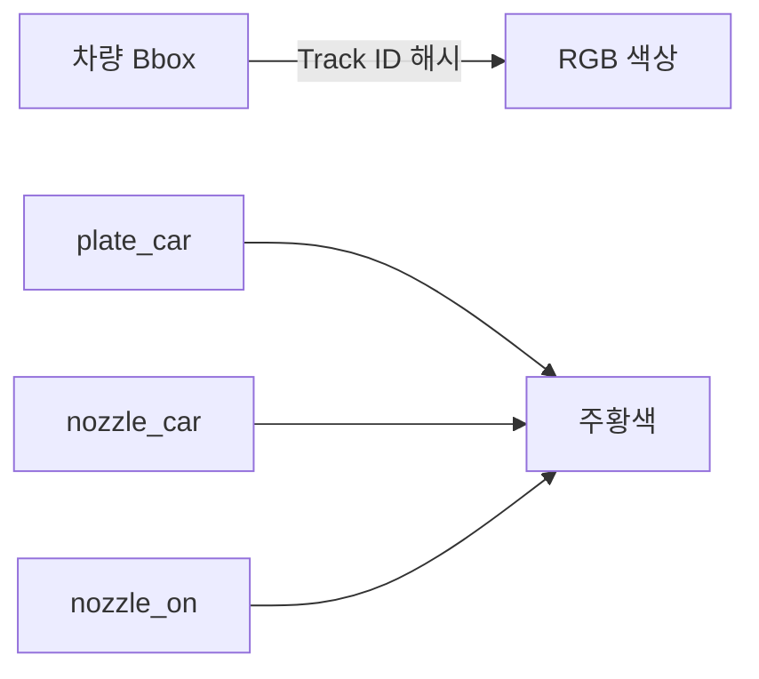
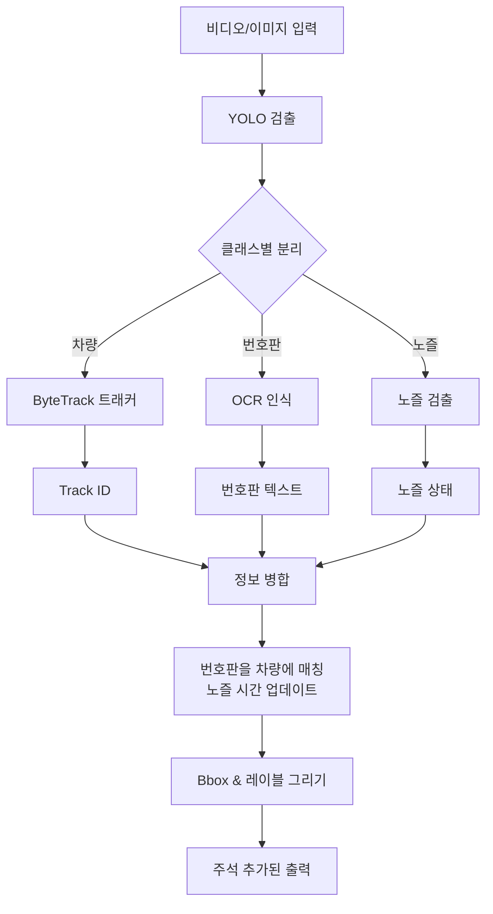
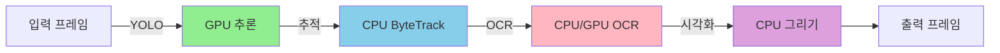

# SK-Gas-Tracking 알고리즘 개요

본 문서는 주유소에서 차량을 추적하고 노즐 상태 인식 및 번호판 OCR을 통해 주유 이벤트를 감지하는 SK-Gas-Tracking 시스템의 알고리즘 흐름을 설명합니다.

---

## 시스템 아키텍처



---

## Main 함수 흐름

### 1. 초기화 단계



**주요 구성요소**:
- **디바이스 설정**: CUDA 사용 가능하면 자동 선택, 아니면 CPU
- **YOLO Predictor**: 차량 및 노즐 검출 모델 로드
- **OCR Processor**: 한국 번호판 인식 모델 로드

---

## 처리 모드

### 모드 1: 이미지 처리

```mermaid
flowchart TB
    Start([image_demo]) --> GetImages[이미지 파일 목록 가져오기]
    GetImages --> InitROI{ROI 사용?}
    
    InitROI -->|예| SelectROI[첫 번째 이미지에서<br/>대화형 ROI 선택]
    InitROI -->|아니오| InitTrackers
    SelectROI --> InitTrackers[트래커 초기화<br/>- ByteTracker<br/>- NozzleStateTracker]
    
    InitTrackers --> Loop{각 이미지 반복}
    Loop -->|다음| ReadImage[이미지 파일 읽기]
    ReadImage --> ProcessFrame[프레임 처리]
    ProcessFrame --> DrawROI[ROI 그리기 (활성화시)]
    DrawROI --> SaveImage[주석 추가된 이미지 저장]
    SaveImage --> Loop
    
    Loop -->|완료| SaveResults[추적 결과 저장]
    SaveResults --> End([종료])
```

### 모드 2: 비디오 처리

```mermaid
flowchart TB
    Start([video_demo]) --> OpenVideo[비디오/웹캠 열기]
    OpenVideo --> InitROI{ROI 사용?}
    
    InitROI -->|예| SelectROI[첫 프레임에서<br/>대화형 ROI 선택]
    InitROI -->|아니오| InitTrackers
    SelectROI --> InitTrackers[트래커 초기화<br/>- ByteTracker<br/>- NozzleStateTracker]
    
    InitTrackers --> SetupOutput[비디오 Writer 설정]
    SetupOutput --> Loop{프레임 읽기}
    
    Loop -->|성공| ProcessFrame[프레임 처리]
    ProcessFrame --> DrawROI[ROI 그리기 (활성화시)]
    DrawROI --> WriteFrame[출력 비디오에 쓰기]
    WriteFrame --> Loop
    
    Loop -->|실패/종료| SaveResults[추적 결과 저장]
    SaveResults --> Cleanup[리소스 해제]
    Cleanup --> End([종료])
```

---

## 핵심 처리: process_frame()

추적 시스템의 핵심으로, 각 프레임을 독립적으로 처리합니다.



---

## 검출 분류

### 추적 vs 검출 전용



**왜 다르게 처리하는가?**
- **추적 클래스**: 차량 추적을 위해 프레임 간 지속적인 ID 필요
- **검출 전용**: 일시적 상태(노즐 부착) 또는 부속물(번호판)

---

## 노즐 상태 추적

시스템은 두 가지 주요 주유 이벤트를 감지합니다:



**로직**:
1. **nozzle_car**: 노즐이 차량에 부착됨 → **주유 시작**
   - nozzle_car 중심점이 차량 bbox 내부에 있을 때 감지
   - 최초 감지 시 타임스탬프 기록 (start 시간)
   - 일시적으로 감지되지 않아도 상태 유지
   - **의미**: 운전자가 차량에 노즐을 꽂고 주유를 시작함

2. **nozzle_on**: 주유 완료 후 노즐을 POS기에 반납 → **주유 종료**
   - 최소 한 대의 차량이 nozzle_car를 가지고 있을 때만 확인
   - nozzle_car는 있지만 nozzle_on이 없는 차량에 대해 타임스탬프 기록 (end 시간)
   - **의미**: 주유 완료 후 운전자가 노즐을 POS기 거치대에 반납함

**타임라인 예시**:
```
10:30:15 - nozzle_car 감지 (start) → 주유 시작
10:30:45 - nozzle_on 감지 (end)   → 주유 완료, 노즐 반납
총 주유 시간: 30초
```

---

## 번호판 매칭



**매칭 규칙**: 번호판 중심점이 차량 바운딩 박스 내부에 있어야 함

---

## 시각화 출력

각 추적된 차량은 다음과 같이 표시됩니다:

```
[번호판] start:YYYY-MM-DD HH:MM:SS end:HH:MM:SS
```

**예시**:
```
[12가3456] start:2025-11-24 10:30:15 end:10:30:45
```

**색상 코딩**:
- **추적 차량**: Track ID 기반 색상 (차량별 고유)
- **검출 전용**: 주황색 박스 (노즐 상태, 번호판)



---

## 데이터 흐름 요약



---

## 핵심 알고리즘

### 1. ROI 필터링
```python
def is_in_roi(bbox):
    center_x = (bbox[0] + bbox[2]) / 2
    center_y = (bbox[1] + bbox[3]) / 2
    return (roi_x1 <= center_x <= roi_x2 and 
            roi_y1 <= center_y <= roi_y2)
```

### 2. 번호판 매칭
```python
def match_plates_to_vehicles(vehicles, plates, ocr_results):
    for vehicle in vehicles:
        for plate_idx, plate_bbox in enumerate(plates):
            plate_center = get_center(plate_bbox)
            if is_inside(plate_center, vehicle.bbox):
                vehicle.plate = ocr_results[plate_idx]
                break
```

### 3. 노즐 상태 업데이트
```python
def update_nozzle_state(nozzle_bbox, vehicles):
    nozzle_center = get_center(nozzle_bbox)
    for vehicle in vehicles:
        if is_inside(nozzle_center, vehicle.bbox):
            if not vehicle.nozzle_car_time:
                vehicle.nozzle_car_time = current_time()
            break
```

---

## 성능 고려사항



- **YOLO**: GPU 가속 (주요 병목)
- **ByteTrack**: CPU (빠름, 최소 오버헤드)
- **OCR**: CPU 또는 GPU (plate_car 검출 시에만 실행)
- **시각화**: CPU (무시할 수 있는 오버헤드)

---

## 출력 구조

```
outputs/
└── YYYYMMDD_HHMMSS_tracking/  (video) 또는 _images/ (image)
    ├── output_video.mp4         # 주석 추가된 비디오
    ├── image_001.jpg            # 주석 추가된 이미지
    ├── image_002.jpg
    └── YYYYMMDD_HHMMSS_results.txt  # MOT 형식 추적 결과
```

**MOT 형식**:
```
frame_id, track_id, x, y, w, h, confidence, -1, -1, -1
```

---

## 요약

SK-Gas-Tracking 시스템은 다음을 결합합니다:
1. **YOLO 객체 검출**: 차량, 노즐, 번호판 검출
2. **ByteTrack**: 프레임 간 차량 ID 유지
3. **OCR**: 한국 번호판 인식
4. **커스텀 로직**: 노즐 상태를 통한 주유 이벤트 추적
5. **시각화**: 포괄적인 추적 정보 표시

이 모듈식 아키텍처는 주유소 환경에서 정확한 차량 추적 및 주유 이벤트 감지를 가능하게 합니다.
